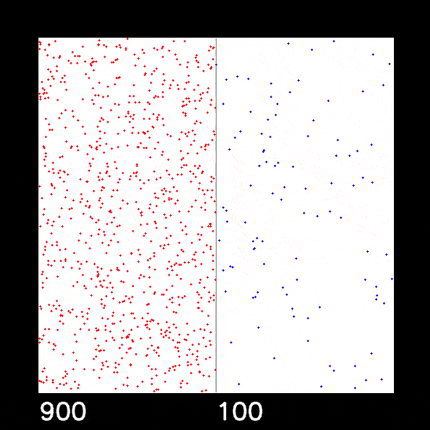
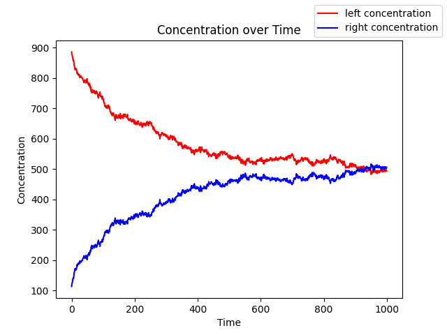

# Diffusion Simulation

Simple particle simulation with random particle movement.

Red dots = Starting position left  
Blue dots = Starting position right  
Numbers = concentration i.e. the number of particles in the respective space  

Particle distribution in the left and right space over time  

